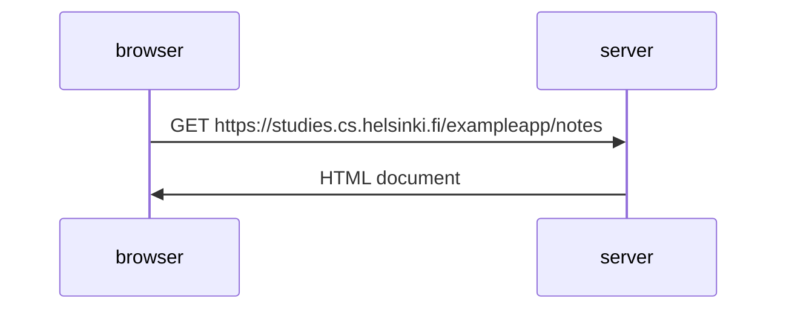
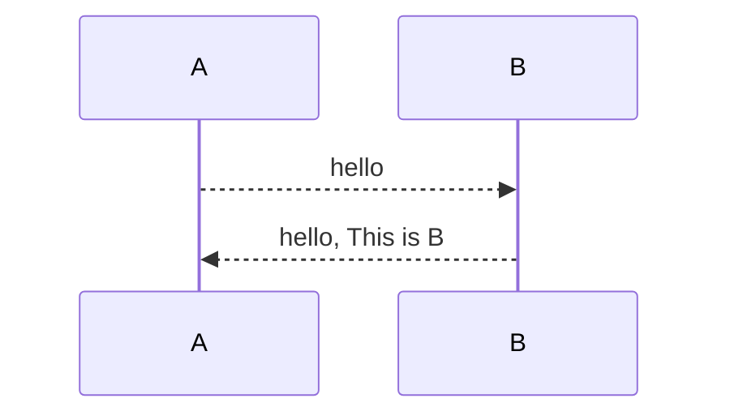
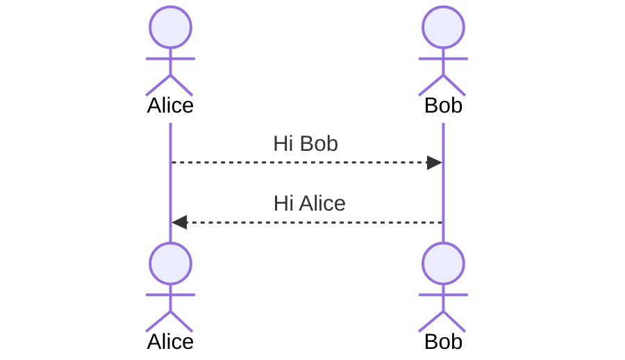
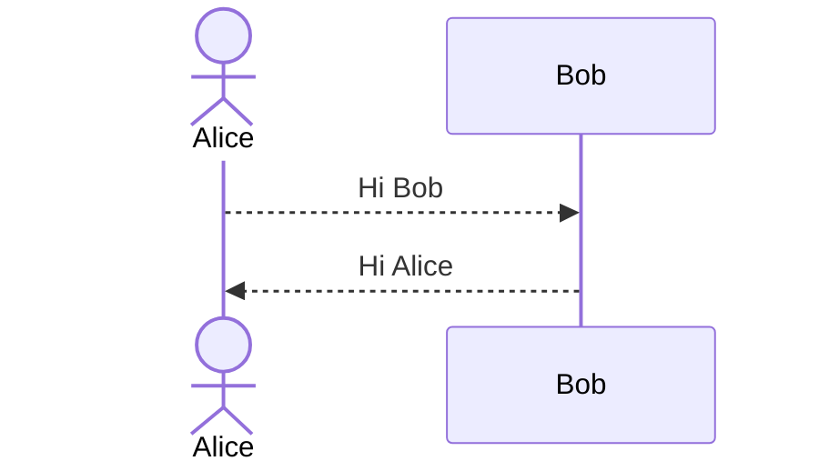
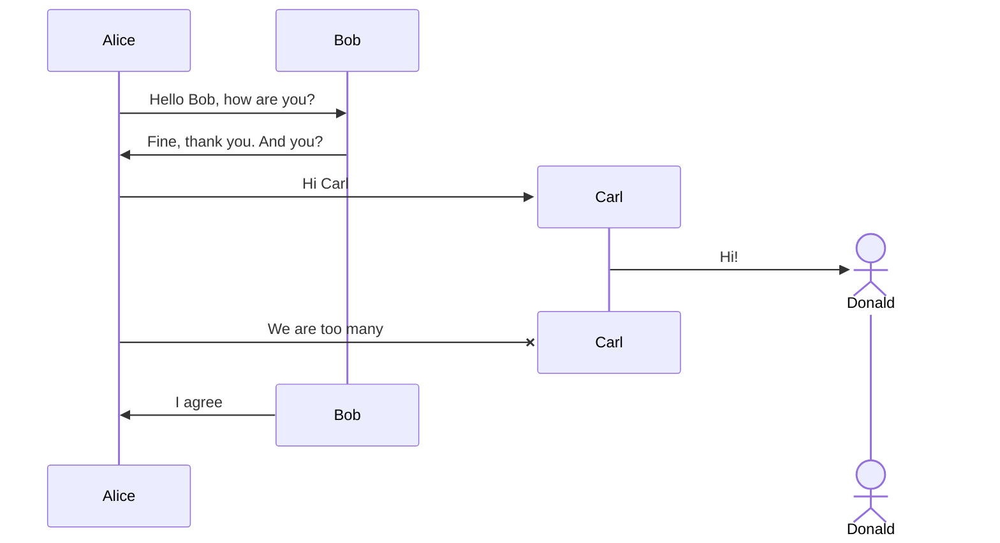
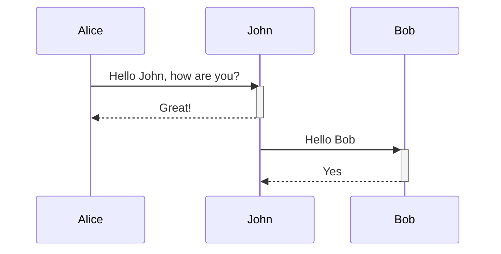
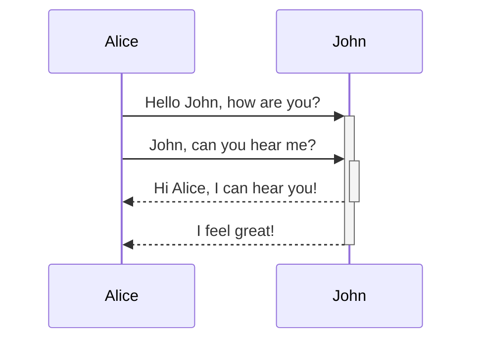
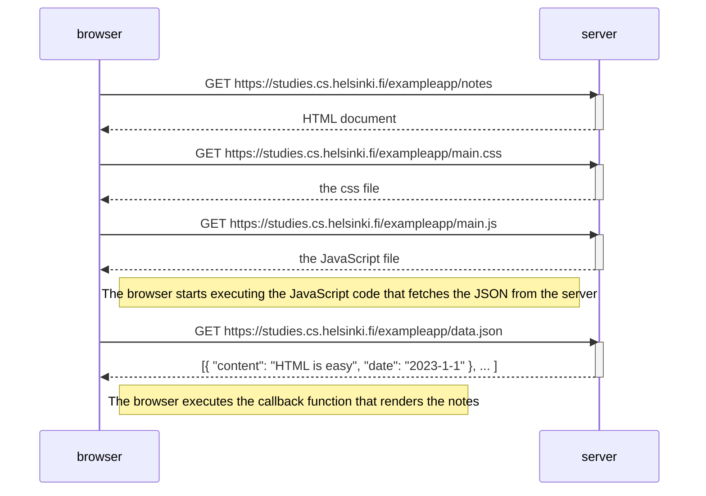
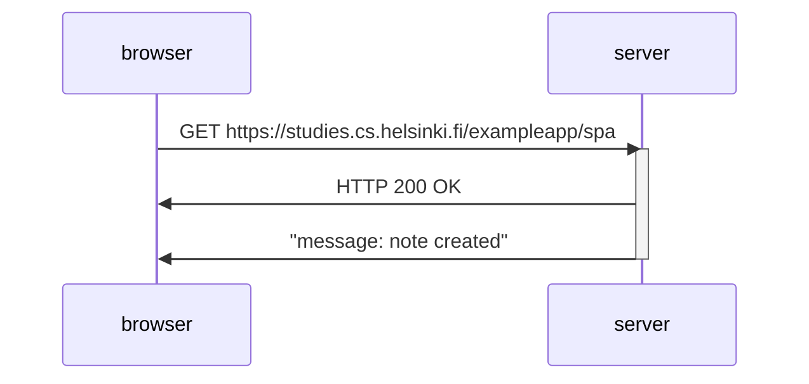
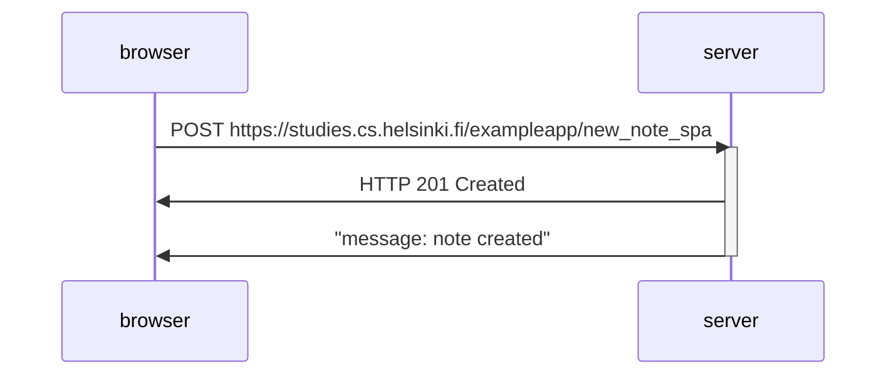

# Full Stack 0

One single-page applications implemented with **React**  and supporting them with **RESTful** and **GraphQL** web services implemented with **Node.js.**

The 1st rule of web development: Always keep the Developer Console open on your web browser. On MacOS, open the console by the pressing fn-F12 or option-cod-i simultaneously. 

Open the console and then Make sure that the *Network* tab is open, and check the *Disable cache* option as shown. *Preserve log* can also be useful (it saves the logs printed by the application when the page is reloaded) as well as "Hide extension URLs"(hides requests of any extensions installed in the browser, not shown in the picture above).

> The Hide extension URLs option is in Network → More filters.
> 

The most important tab is the Console tab.

# HTTP GET

The server and the web browser communicate with each other using the HTTP protocol. The *Network* tab shows how the browser and the server communicate.

- Reload the page, and then we can find out that two events have happened.
    - The browser has fetched the contents of the page exampleapp from the server.
    - And has downloaded the image kuva.png
    
    
    
- Click the first event reveals more information
    - General
        - Requested address: **https://studies.cs.helsinki.fi/exampleapp/**
        - Requested Method: Get
        - Status Code: 200 OK
        - Remote Address: **128.214.137.97:443**
        - Referrer Policy: strict-origin-when-cross-origin
    - Response Header
        
        The response headers on top tell us e.g. the size of the response in bytes and the exact time of the response. Content-Type tells. Us that the response is a text file in Ute-8 format and the contents of which have been formatted with HTML.
        
        - Content-Length: 321 (bytes)
        - Context-Type: text/html; charset=utf-8
        - Date: Thu, 13 Mar 2025 20:19:08 GMT
        - Etag?
        - Server: nginx/1.20.1
    - Request Header
    - Response tab
        
        The tab shows the response data, a regular HTML page. The body section determines the structure of the the page rendered to the screen.
        
        Because of the Imgur tag, the browser does a second HTTP request to fetch the image kuva.png from the server.
        
        > Even though it is difficult to notice, the HTML page begins to render before the image has been fetched from the server.
        > 
        
        ```html
            <html>
              <head> <!--HTML HEAD-->
              </head> 
              <body> <!--HTML BODY -->
                <div class='container'> <!--The Content Division element-->
                  <h1>Full stack example app</h1>
                  <p>number of notes created 100</p>
                  <a href='/exampleapp/notes'>notes</a>
                   <!--Image-->
                </div>
              </body>
            </html>
        ```
        

# Traditional web application

Homepage of the example application works like a traditional web application.

When entering the page, the browser fetches the HTML document detailing the structure and the textual content of the page from the server.

Static text file or dynamic HTML document.

```jsx
const getFrontPageHtml = noteCount => {
  return `
    <!DOCTYPE html>
    <html>
      <head>
      </head>
      <body>
        <div class='container'>
          <h1>Full stack example app</h1>
          <p>number of notes created ${noteCount}</p>
          <a href='/notes'>notes</a>
          
        </div>
      </body>
    </html>
`
}

app.get('/', (req, res) => {
  const page = getFrontPageHtml(notes.length)
  res.send(page)
})
```

Writing HTML amid the code is of course not smart, but for old-school PHP programmers, it was a normal practice. (PHP is too old, modern web page won’t use php)

In traditional web applications, the browser is "dumb". It only fetches HTML data from the server, and all application logic is on the server. A server can be created using [Java Spring](https://spring.io/projects/spring-framework) , [Python Flask](https://flask.palletsprojects.com/en/2.2.x/) or [Ruby on Rails](http://rubyonrails.org/) to name just a few examples.

The example uses [Express](https://expressjs.com/) library with Node.js. This course will use Node.js and Express to create web servers.

# Running application logic in the browser

When we compare the pages shown on the browser and the HTNL code returned by the server, the code does not contain the list of nodes. The head section of the HTML contains a script tag, which causes the browser to fetch a JS file called main.js.

```html

<!DOCTYPE html>
<html>
<head>
  <link rel="stylesheet" type="text/css" href="/exampleapp/main.css" />
  <script type="text/javascript" src="/exampleapp/main.js"></script>
</head>
<body>
  <div class='container'>
    <h1>Notes</h1>
    <!--The id element will be generated by main.js-->
    <div id='notes'>
    </div>
    <form action='/exampleapp/new_note' method='POST'>
      <input type="text" name="note"><br>
      <input type="submit" value="Save">
    </form>
  </div>
</body>
</html>

```

The main.js is like:

```jsx
var xhttp = new XMLHttpRequest()

xhttp.onreadystatechange = function() {
  if (this.readyState == 4 && this.status == 200) {
    const data = JSON.parse(this.responseText)
    console.log(data)

    var ul = document.createElement('ul')
    //This "notes" is same with the HTML <div id='notes'>
    ul.setAttribute('class', 'notes') 
	
		// We will generate a list according to the data from data.json
    data.forEach(function(note) {
	    // add li tag for each note.
      var li = document.createElement('li')

      ul.appendChild(li)
      li.appendChild(document.createTextNode(note.content))
    })
		
		// We will return this html element back with id='notes'
    document.getElementById('notes').appendChild(ul)
  }
}

xhttp.open('GET', '/data.json', true)
xhttp.send()
```

> Some might wonder why xhttp-object is used instead of the modern fetch. This is due to not wanting to go into promises at all yet, and the code having a secondary role in this part. We will return to modern ways to make requests to the server in [part 2](https://fullstackopen.com/en/part2).
> 

The console.log(data) will shown in the console of the local browser.


# Event handlers and Callback functions

The structure of the code is a bit odd:

```jsx
var xhttp = new XMLHttpRequest()

xhttp.onreadystatechange = function() {
  // code that takes care of the server response
}

xhttp.open('GET', '/data.json', true)
xhttp.send()
```

The request to the server is sent on the last line, but the code to handle the response can be found further up. What’s going on?

```jsx
xhttp.onreadystatechange = function() {
```

On this line, an event handler for the event `onreadystatechagne`  is defined for the http object doing the request. Only when the state of the object changes, the browser calls the event handler function. The function code checks that the [readyState](https://developer.mozilla.org/en-US/docs/Web/API/XMLHttpRequest/readyState) equals 4 and that HTTP status code of the response is 200.

| **Value** | **State** | **Description** |
| --- | --- | --- |
| **0** | **UNSENT** | **Client has been created. open() not called yet.** |
| **1** | **OPENED** | **open() has been called.** |
| **2** | **HEADERS_RECEIVED** | **send() has been called, and headers and status are available.** |
| **3** | **LOADING** | **Downloading; responseText holds partial data.** |
| **4** | **DONE** | **The operation is complete.** |

More information can see [https://xhr.spec.whatwg.org/#states](https://xhr.spec.whatwg.org/#states).

The mechanism of invoking event handlers is very common in JavaScript. Event handler functions are called [callback](https://developer.mozilla.org/en-US/docs/Glossary/Callback_function) functions. The application code does not invoke the functions itself, but the runtime environment - the browser, invokes the function at an appropriate time when the *event* has occurred.

# Document Object Model or DOM

The functioning of the browser is based on the idea of depicting HTML elements as a tree.

```markdown
html
  head
    link
    script
  body
    div
      h1
      div
        ul
          li
          li
          li
      form
        input
        input
```

Document Object Model, or [DOM](https://en.wikipedia.org/wiki/Document_Object_Model), is an Application Programming Interface (*API*) that enables programmatic modification of the *element trees* corresponding to web pages.

The JavaScript code introduced in the previous chapter used the DOM-API to add a list of notes to the page.

```jsx
var ul = document.createElement('ul')

data.forEach(function(note) {
  var li = document.createElement('li')

  ul.appendChild(li)
  li.appendChild(document.createTextNode(note.content))
})
```

Finally, the tree branch of the ul variable is connected to its proper place in the HTML tree of the whole page:

```jsx
document.getElementById('notes').appendChild(ul)
```

# Manipulating the document object from console

The topmost node of the DOM tree of an HTML document is called the document object.

We can access the document object in the console.


We can add a new note to the page through the console.

First, we’ll get the list of notes from the page. The list is in the first ul-element of the page

```jsx
// The return of getElementsByTagName is a HTMLCollection object
list = document.getElementsByTagName('ul')[0]
```

Then create a new li-element and add some text content to li

```jsx
newElement = document.createElement('li')
newElement.textContent = 'Page manipulation from console is easy'
```

And add the new li-element to the list:

```jsx
list.appendChild(newElement)
```

Even though the page updates on your browser, the changes are not permanent. If the page is reloaded, the new note will disappear, because the changes were not pushed to the server. The JavaScript code the browser fetches will always create the list of notes based on JSON data from the address [https://studies.cs.helsinki.fi/exampleapp/data.json](https://studies.cs.helsinki.fi/exampleapp/data.json).

# CSS

The *head* element of the HTML code of the Notes page contains a [link](https://developer.mozilla.org/en-US/docs/Web/HTML/Element/link) tag, which determines that the browser must fetch a [CSS](https://developer.mozilla.org/en-US/docs/Web/CSS) style sheet from the address [main.css](https://studies.cs.helsinki.fi/exampleapp/main.css).

```html
  <link rel="stylesheet" type="text/css" href="/exampleapp/main.css" />
```

Cascading Style Sheets, or CSS, is a style sheet language used to determine the appearance of web pages.

```css
.container {
  padding: 10px;
  border: 1px solid;
}

.notes {
  color: blue;
}
```

The CSS file has several components.  Each of the components has a title, which is directly to describe a specific element of the main html.

- container → container
- notes → notes

```html
  <div class='container'>
    <h1>Notes</h1>
    <div id='notes'>
    </div>
    <form action='/exampleapp/new_note' method='POST'>
      <input type="text" name="note"><br>
      <input type="submit" value="Save">
    </form>
  </div>
```

The file defines two [class selectors](https://developer.mozilla.org/en-US/docs/Web/CSS/Class_selectors). These are used to select certain parts of the page and to define styling rules to style them.

Classes are [attributes](https://developer.mozilla.org/en-US/docs/Web/HTML/Global_attributes/class), which can be added to HTML elements.

The CSS rule defines that elements with the *container* class will be outlined with a one-pixel wide [border](https://developer.mozilla.org/en-US/docs/Web/CSS/border). It also sets 10-pixel [padding](https://developer.mozilla.org/en-US/docs/Web/CSS/padding) on the element. This adds some empty space between the element's content and the border.


# Loading a page containing JavaScript - review

- The browser fetches the HTML code defining the content and the structure of the page from the server using an HTTP GET request.
- Links in the HTML code cause the browser to also fetch the CSS style sheet *main.css*...
- ...and the JavaScript code file *main.js*
- The browser executes the JavaScript code. The code makes an HTTP GET request to the address [https://studies.cs.helsinki.fi/exampleapp/data.json](https://studies.cs.helsinki.fi/exampleapp/data.json), which returns the notes as JSON data.
- When the data has been fetched, the browser executes an *event handler*, which renders the notes to the page using the DOM-API.

# Forms and HTTP POST

The Notes page contains a [form element](https://developer.mozilla.org/en-US/docs/Learn/HTML/Forms/Your_first_HTML_form).

The Form tag has attributes *action* and *method*, which define that submitting the form is done as an HTTP POST request to the address *new_note*.

```html
    <form action='/exampleapp/new_note' method='POST'>
      <input type="text" name="note"><br>
      <input type="submit" value="Save">
    </form>
```

When the button on the form is clicked, the browser will send the user input to the server.

It is an [HTTP POST](https://developer.mozilla.org/en-US/docs/Web/HTTP/Methods/POST) request to the server address *new_note*. The server responds with HTTP status code 302. This is a [URL redirect](https://en.wikipedia.org/wiki/URL_redirection), with which the server asks the browser to perform a new HTTP GET request to the address defined in the header's *Location* - the address `/exampleapp/*notes*`.


So, the browser reloads the Notes page. The reload causes three more HTTP requests: fetching the style sheet (main.css), the JavaScript code (main.js), and the raw data of the notes (data.json).

The network tab also shows the data submitted with the form:

The Form Data dropdown is within the new Payload tab, located to the right of the Headers tab.


The code in the server for the POST request is quite simple.

```jsx
app.post('/new_note', (req, res) => {
  notes.push({
    content: req.body.note,
    date: new Date(),
  })

  return res.redirect('/notes')
})
```

Data is sent as the [body](https://developer.mozilla.org/en-US/docs/Web/HTTP/Methods/POST) of the POST request.

The server can access the data by accessing the req.body field of the request object req.

The server creates a new note object, and adds it to an array called notes.

Each note object has two fields: *content* containing the actual content of the note, and *date* containing the date and time the note was created.

The server does not save new notes to a database, so new notes disappear when the server is restarted.

# AJAX

The Notes page of the application follows an early-nineties style of web development and uses "Ajax". As such, it's on the crest of the wave of early 2000s web technology.

[AJAX](https://en.wikipedia.org/wiki/Ajax_(programming)) (Asynchronous JavaScript and XML) is a term introduced in February 2005 on the back of advancements in browser technology to describe a new revolutionary approach that enabled the fetching of content to web pages using JavaScript included within the HTML, without the need to rerender the page.

Before the AJAX era, all web pages worked like the [traditional web application](https://fullstackopen.com/en/part0/fundamentals_of_web_apps#traditional-web-applications) we saw earlier in this chapter. All of the data shown on the page was fetched with the HTML code generated by the server.

The Notes page uses AJAX to fetch the notes data. Submitting the form still uses the traditional mechanism of submitting web forms.

The application URLs reflect the old, carefree times. JSON data is fetched from the URL [https://studies.cs.helsinki.fi/exampleapp/data.json](https://studies.cs.helsinki.fi/exampleapp/data.json) and new notes are sent to the URL [https://studies.cs.helsinki.fi/exampleapp/new_note](https://studies.cs.helsinki.fi/exampleapp/new_note). Nowadays URLs like these would not be considered acceptable, as they don't follow the generally acknowledged conventions of [RESTful](https://en.wikipedia.org/wiki/Representational_state_transfer#Applied_to_web_services) APIs, which we'll look into more in [part 3](https://fullstackopen.com/en/part3).

> Do not use the extension of the file. Instead, we use `/exampleapp/data`.
Do not use `_`, use `-` instead. Because many search engine recommend this.
> 

The thing termed AJAX is now so commonplace that it's taken for granted. The term has faded into oblivion, and the new generation has not even heard of it.

# Single Page app

The Notes page gives some of the responsibility, generating the HTML code for existing notes, to the browser. The browser tackles this task by executing the JavaScript code it fetched from the server. The code fetches the notes from the server as JSON data and adds HTML elements for displaying the notes to the page using the [DOM-API](https://fullstackopen.com/en/part0/fundamentals_of_web_apps#document-object-model-or-dom).

In recent years, the [Single-page application](https://en.wikipedia.org/wiki/Single-page_application) (SPA) style of creating web applications has emerged. SPA-style websites don't fetch all of their pages separately from the server like our sample application does, but instead comprise only one HTML page fetched from the server, the contents of which are manipulated with JavaScript that executes in the browser.

```html

<!DOCTYPE html>
<html>
<head>
  <link rel="stylesheet" type="text/css" href="/exampleapp/main.css" />
  <script type="text/javascript" src="/exampleapp/spa.js"></script>
</head>
<body>
  <div class='container'>
    <h1>Notes -- single page app</h1>
    <div id='notes'>
    </div>
    <form id='notes_form'>
      <input type="text" name="note"><br>
      <input type="submit" value="Save">
    </form>
  </div>
</body>
</html>

```

```jsx
var notes = []

var redrawNotes = function() {
  var ul = document.createElement('ul')
  ul.setAttribute('class', 'notes')

  notes.forEach(function (note) {
    var li = document.createElement('li')

    ul.appendChild(li);
    li.appendChild(document.createTextNode(note.content))
  })

  var notesElement = document.getElementById("notes")
  if (notesElement.hasChildNodes()) {
    notesElement.removeChild(notesElement.childNodes[0]);
  }
  notesElement.appendChild(ul)
}

var xhttp = new XMLHttpRequest()

xhttp.onreadystatechange = function () {
  if (this.readyState == 4 && this.status == 200) {
    notes = JSON.parse(this.responseText)
    redrawNotes()
  }
}

xhttp.open("GET", "/exampleapp/data.json", true)
xhttp.send()

var sendToServer = function (note) {
  var xhttpForPost = new XMLHttpRequest()
  xhttpForPost.onreadystatechange = function () {
    if (this.readyState == 4 && this.status == 201) {
      console.log(this.responseText)
    }
  }

  xhttpForPost.open("POST", '/exampleapp/new_note_spa', true)
  xhttpForPost.setRequestHeader("Content-type", "application/json")
  xhttpForPost.send(JSON.stringify(note));
}

window.onload = function (e) {
  var form = document.getElementById("notes_form")
  form.onsubmit = function (e) {
    e.preventDefault()

    var note = {
      content: e.target.elements[0].value,
      date: new Date()
    }

    notes.push(note)
    e.target.elements[0].value = ""
    redrawNotes()
    sendToServer(note)
  }
}

```

The form has no *action* or *method* attributes to define how and where to send the input data.

Open the *Network* tab and empty it. When you now create a new note, you'll notice that the browser sends only one request to the server.

The POST request to the address *new_note_spa* contains the new note as JSON data containing both the content of the note (*content*) and the timestamp (*date*):


The *Content-Type* header of the request tells the server that the included data is represented in JSON format.


Without this header, the server would not know how to correctly parse the data.

The server responds with status code [201 created](https://httpstatuses.com/201). This time the server does not ask for a redirect, the browser stays on the same page, and it sends no further HTTP requests.

The SPA version of the app does not traditionally send the form data, but instead uses the JavaScript code it fetched from the server. We'll look into this code a bit, even though understanding all the details of it is not important just yet.

```jsx
var form = document.getElementById('notes_form')
form.onsubmit = function(e) {
  e.preventDefault()

  var note = {
    content: e.target.elements[0].value,
    date: new Date(),
  }

  notes.push(note)
  e.target.elements[0].value = ''
  redrawNotes()
  sendToServer(note)
}
```

The command document.getElementById('notes_form') instructs the code to fetch a reference to the HTML form element on the page that has the ID "notes_form" and to register an *event handler* to handle the form's submit event. The event handler immediately calls the method e.preventDefault() to prevent the default handling of form's submit. The default method would send the data to the server and cause a new GET request, which we don't want to happen.

Then the event handler creates a new note, adds it to the notes list with the command notes.push(note), rerenders the note list on the page and sends the new note to the server.

The code for sending the note to the server is as follows:

```jsx
var sendToServer = function(note) {
  var xhttpForPost = new XMLHttpRequest()
  // ...

  xhttpForPost.open('POST', '/new_note_spa', true)
  xhttpForPost.setRequestHeader('Content-type', 'application/json')
  xhttpForPost.send(JSON.stringify(note))
}
```

The code determines that the data is to be sent with an HTTP POST request and the data type is to be JSON. The data type is determined with a *Content-type* header. Then the data is sent as JSON string.

The application code is available at [https://github.com/mluukkai/example_app](https://github.com/mluukkai/example_app). It's worth remembering that the application is only meant to demonstrate the concepts of the course. The code follows a poor style of development in some measures, and should not be used as an example when creating your applications. The same is true for the URLs used. The URL *new_note_spa* that new notes are sent to, does not adhere to current best practices.

# JavaScript-libraries

The sample app is done with so-called [vanilla JavaScript](https://www.freecodecamp.org/news/is-vanilla-javascript-worth-learning-absolutely-c2c67140ac34/), using only the DOM-API and JavaScript to manipulate the structure of the pages.

> In fact, nowadays, people will use different frameworks to write a web application. The way using only the DOM-API and JavaScript can be only considered  as a study sample.
> 

Instead of using JavaScript and the DOM-API only, different libraries containing tools that are easier to work with compared to the DOM-API are often used to manipulate pages. One of these libraries is the ever-so-popular [jQuery](https://jquery.com/).

jQuery was developed back when web applications mainly followed the traditional style of the server generating HTML pages, the functionality of which was enhanced on the browser side using JavaScript written with jQuery. One of the reasons for the success of jQuery was its so-called cross-browser compatibility. The library worked regardless of the browser or the company that made it, so there was no need for browser-specific solutions. Nowadays using jQuery is not as justified given the advancement of JavaScript, and the most popular browsers generally support basic functionalities well.

> This means that query also based on the old rules and also didn’t suit for modern web applications.
> 

The rise of the single-page app brought several more "modern" ways of web development than jQuery. The favorite of the first wave of developers was [BackboneJS](http://backbonejs.org/). After its [launch](https://github.com/angular/angular.js/blob/master/CHANGELOG.md#100rc1-moir%C3%A9-vision-2012-03-13) in 2012, Google's [AngularJS](https://angularjs.org/) quickly became almost the de facto standard of modern web development.

However, the popularity of Angular plummeted in October 2014 after the [Angular team announced that support for version 1 will end](https://web.archive.org/web/20151208002550/https://jaxenter.com/angular-2-0-announcement-backfires-112127.html), and that Angular 2 will not be backwards compatible with the first version. Angular 2 and the newer versions have not received too warm of a welcome.

Currently, the most popular tool for implementing the browser-side logic of web applications is Facebook's [React](https://react.dev/) library. During this course, we will get familiar with React and the [Redux](https://github.com/reactjs/redux) library, which are frequently used together.

The status of React seems strong, but the world of JavaScript is ever-changing. For example, recently a newcomer - [VueJS](https://vuejs.org/) - has been capturing some interest.

# Full-stack web development

What does the name of the course, *Full stack web development*, mean? Full stack is a buzzword that everyone talks about, but no one knows what it means. Or at least, there is no agreed-upon definition for the term.

Practically all web applications have (at least) two "layers": the browser, being closer to the end-user, is the top layer, and the server the bottom one. There is often also a database layer below the server. We can therefore think of the *architecture* of a web application as a *stack* of layers.

Often, we also talk about the [frontend and the backend](https://en.wikipedia.org/wiki/Front_and_back_ends). The browser is the frontend, and the JavaScript that runs on the browser is the frontend code. The server on the other hand is the backend.

In the context of this course, full-stack web development means that we focus on all parts of the application: the frontend, the backend, and the database. Sometimes the software on the server and its operating system are seen as parts of the stack, but we won't go into those.

We will code the backend with JavaScript, using the [Node.js](https://nodejs.org/en/) runtime environment. Using the same programming language on multiple layers of the stack gives full-stack web development a whole new dimension. However, it's not a requirement of full-stack web development to use the same programming language (JavaScript) for all layers of the stack.

It used to be more common for developers to specialize in one layer of the stack, for example, the backend. Technologies on the backend and the frontend were quite different. With the Full stack trend, it has become common for developers to be proficient in all layers of the application and the database. Oftentimes, full-stack developers must also have enough configuration and administration skills to operate their applications, for example, in the cloud.

# **JavaScript fatigue**

Full-stack web development is challenging in many ways. Things are happening in many places at once, and debugging is quite a bit harder than with regular desktop applications. JavaScript does not always work as you'd expect it to (compared to many other languages), and the asynchronous way its runtime environments work causes all sorts of challenges. Communicating on the web requires knowledge of the HTTP protocol. One must also handle databases and server administration and configuration. It would also be good to know enough CSS to make applications at least somewhat presentable.

The world of JavaScript develops fast, which brings its own set of challenges. Tools, libraries and the language itself are under constant development. Some are starting to get tired of the constant change, and have coined a term for it: JavaScript fatigue. See [How to Manage JavaScript Fatigue on auth0](https://auth0.com/blog/how-to-manage-javascript-fatigue/) or [JavaScript fatigue on Medium](https://medium.com/@ericclemmons/javascript-fatigue-48d4011b6fc4).

You will suffer from JavaScript fatigue yourself during this course. Fortunately for us, there are a few ways to smooth the learning curve, and we can start with coding instead of configuration. We can't avoid configuration completely, but we can merrily push ahead in the next few weeks while avoiding the worst of configuration hells.

# Exercise

In GitHub.

## 0.1 HTML

HTML (HyperText Markup Language) is a markup language that defines the structure of your content. It consists of a series of elements which you use to enclose, or wrap, different parts of the content to make it appear a certain way, or act a certain way**.** The enclosing tags can make a word or image hyperlink to somewhere else, can italicize words, can make the font bigger or smaller, and so on.

### Anatomy of an HTML element


1. **The opening tag:** This consists of the name of the element (in this case, p), wrapped in opening and closing **angle brackets**. This states where the element begins or starts to take effect — in this case where the paragraph begins.
2. **The closing tag:** This is the same as the opening tag, except that it includes a *forward slash* before the element name. This states where the element ends — in this case where the paragraph ends. Failing to add a closing tag is one of the standard beginner errors and can lead to strange results.
3. **The content:** This is the content of the element, which in this case, is just text.
4. **The element:** The opening tag, the closing tag, and the content together comprise the element.

### Nesting elements

You can put elements inside other elements too — this is called **nesting**. If we wanted to state that our cat is very grumpy, we could wrap the word “very” in a `<strong>` element.

```html
<p>My cat is <strong>very</strong> grumpy.</p>
```

### Void elements

Some elements have no content and are called [**void elements**](https://developer.mozilla.org/en-US/docs/Glossary/Void_element). Take the [``](https://developer.mozilla.org/en-US/docs/Web/HTML/Element/img) element that we already have in our HTML page:

```html

```

This contains two attributes, but there is no closing `</img>` tag and no inner content. This is because an image element doesn't wrap content to affect it. Its purpose is to embed an image in the HTML page in the place it appears.

### Elements

```html
<!-- Heading -->
<h1>My main title</h1>
<h2>My top level heading</h2>
<h3>My subheading</h3>
<h4>My sub-subheading</h4>

<!-- paragraph -->
<p>This is a single paragraph</p>

<!-- unordered list -->
<p>At Mozilla, we're a global community of</p>
<ul>
  <li>technologists</li>
  <li>thinkers</li>
  <li>builders</li>
</ul>
<p>working together…</p>

<!-- ordered list -->
<p>At Mozilla, we're a global community of</p>
<ol>
  <li>technologists</li>
  <li>thinkers</li>
  <li>builders</li>
</ol>
<p>working together…</p>

<!-- links -->
<a href="https://www.mozilla.org/en-US/about/manifesto/">
  Mozilla Manifesto
</a>

```

## 0.2 CSS: Styling the content

CSS is not a programming language. It’s not a markup language. CSS is a style sheet language.

```css
p {
	color: red;
}
```

Set p color to red.

### Anatomy of a CSS ruleset

The whole structure is called a ruleset.


**Selector**

This is the HTML element name at the start of the ruleset. It defines the element(s) to be styled (in this example, [`<p>`](https://developer.mozilla.org/en-US/docs/Web/HTML/Element/p) elements). To style a different element, change the selector.

**Declaration**

This is a single rule like `color: red;`. It specifies which of the element's **properties** you want to style.

**Properties**

These are features of an HTML element that you can change the values of, to make it styled differently. (In this example, `color` is a property of the [`<p>`](https://developer.mozilla.org/en-US/docs/Web/HTML/Element/p) elements.) In CSS, you choose which properties you want to affect in the rule.

**Property Value**

To the right of the property—after the colon—there is the **property value**. This chooses one out of many possible appearances for a given property. (For example, there are many `color` values in addition to `red`.)

```css
p {
  color: red;
  width: 500px;
  border: 1px solid black;
}
```

### Selecting multiple elements

```css
p,
li,
h1 {
  color: red;
}
```

### Different types of selectors

There are many different types of selectors. The examples above use **element selectors**, which select all elements of a given type. But we can make more specific selections as well. Here are some of the more common types of selectors:

| Selector name | What does it select | Example |
| --- | --- | --- |
| Element selector (sometimes called a tag or type selector) | All HTML elements of the specified type. | `p`selects `<p>` |
| ID selector | The element on the page with the specified ID. On a given HTML page, each id value should be unique. | `#my-id`selects `<p id="my-id">` or `<a id="my-id">` |
| Class selector | The element(s) on the page with the specified class. Multiple instances of the same class can appear on a page. | `.my-class`selects `<p class="my-class">` and `<a class="my-class">` |
| Attribute selector | The element(s) on the page with the specified attribute. | `img[src]`selects `` but not `` |
| Pseudo-class selector | The specified element(s), but only when in the specified state. (For example, when a cursor hovers over a link.) | `a:hover`selects `<a>`, but only when the mouse pointer is hovering over the link. |

There are many more selectors to discover. To learn more, see our selectors tutorials, starting with [Basic selectors](https://developer.mozilla.org/en-US/docs/Learn_web_development/Core/Styling_basics/Basic_selectors).

### Fonts and text

Now that we've explored some CSS fundamentals, let's improve the appearance of the example by adding more rules and information to the `style.css` file.

1. First, find the [output from Google Fonts](https://developer.mozilla.org/en-US/docs/Learn_web_development/Getting_started/Your_first_website/What_will_your_website_look_like#font) that you previously saved from [What will your website look like?](https://developer.mozilla.org/en-US/docs/Learn_web_development/Getting_started/Your_first_website/What_will_your_website_look_like). Add the [`<link>`](https://developer.mozilla.org/en-US/docs/Web/HTML/Element/link) element somewhere inside your `index.html`'s head (anywhere between the [`<head>`](https://developer.mozilla.org/en-US/docs/Web/HTML/Element/head) and `</head>` tags). It looks something like this:
    
    htmlCopy to Clipboard
    
    ```html
    <link
      href="https://fonts.googleapis.com/css?family=Open+Sans"rel="stylesheet" />
    ```
    
    This code links your page to a style sheet that loads the Open Sans font family with your webpage.
    
2. Next, delete the existing rule you have in your `style.css` file. It was a good test, but let's not continue with lots of red text.
3. Add the following lines (shown below), replacing the `font-family` assignment with your `font-family` selection from [What will your website look like?](https://developer.mozilla.org/en-US/docs/Learn_web_development/Getting_started/Your_first_website/What_will_your_website_look_like#font). The property `font-family` refers to the font(s) you want to use for text. This rule defines a global base font and font size for the whole page. Since [`<html>`](https://developer.mozilla.org/en-US/docs/Web/HTML/Element/html) is the parent element of the whole page, all elements inside it inherit the same `font-size` and `font-family`.
    
    cssCopy to Clipboard
    
    ```css
    html {
      font-size: 10px; /* px means "pixels": the base font size is now 10 pixels high */
      font-family:
        "Open Sans", sans-serif; /* this should be the rest of the output you got from Google Fonts */
    }
    
    ```
    
    **Note:** Anything in CSS between `/*` and `*/` is a **CSS comment**. The browser ignores comments as it renders the code. CSS comments are a way for you to write helpful notes about your code or logic.
    
4. Now let's set font sizes for elements that will have text inside the HTML body ([<h1>](https://developer.mozilla.org/en-US/docs/Web/HTML/Element/Heading_Elements), [`<li>`](https://developer.mozilla.org/en-US/docs/Web/HTML/Element/li), and [`<p>`](https://developer.mozilla.org/en-US/docs/Web/HTML/Element/p)). We'll also center the heading. Finally, let's expand the second ruleset (below) with settings for line height and letter spacing to make body content more readable.
    
    cssCopy to Clipboard
    
    ```css
    h1 {
      font-size: 60px;
      text-align: center;
    }
    
    p,
    li {
      font-size: 16px;
      line-height: 2;
      letter-spacing: 1px;
    }
    
    ```
    

Adjust the `px` values as you like. Your work-in-progress should look similar to this:

### CSS box

CSS layout is mostly based on the *box model.* Each box taking up space on your page has properties like:

- `padding`, the space around the content. In the example below, it is the space around the paragraph text.
- `border`, the solid line that is just outside the padding.
- `margin`, the space around the outside of the border.

### Styling the body

```css
body {
  width: 600px;
  margin: 0 auto;
  background-color: #ff9500;
  padding: 0 20px 20px 20px;
  border: 5px solid black;
}
```

### Positioning and styling the main page title

 

```css
h1 {
  margin: 0;
  padding: 20px 0;
  color: #00539f;
  text-shadow: 3px 3px 1px black;
}
```

## 0.4 New note diagram

Mermaid lets us create diagrams and visualizations using text and code.

Mermaid can render sequence diagrams.



The participants can defined implicitly. (If we define explicitly, we can specify the actor’s order of appearance.



Also we can use the actor symbol instead of a rectangle with actor statements.



Also we can use an aliases.



Mermaid also support creation and destruction of actor and participant.



Also, it is possible to activate and deactivate an actor. 

**There is also a shortcut notation by appending** +**/**- **suffix to the message arrow:**



**Activations can be stacked for same actor:**



Diagram of server and client.



## 0.5 Single page app diagram



## 0.6 New note in Single page app diagram

